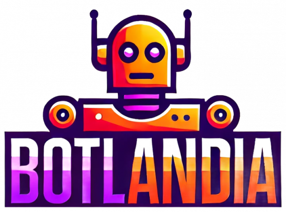
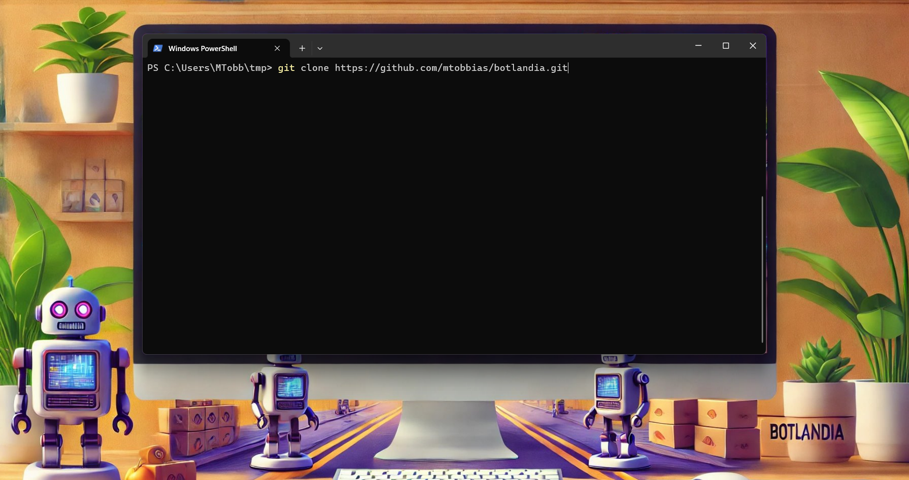
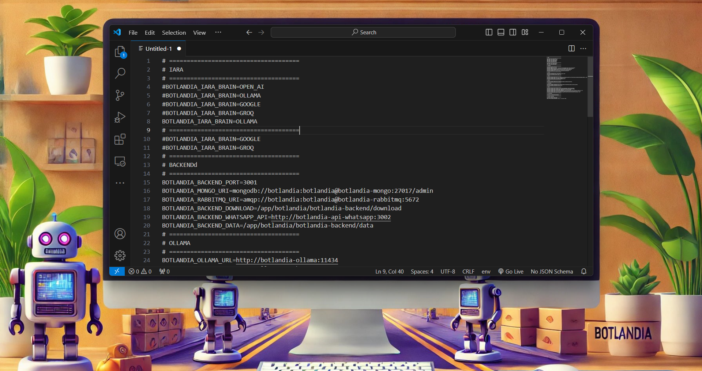
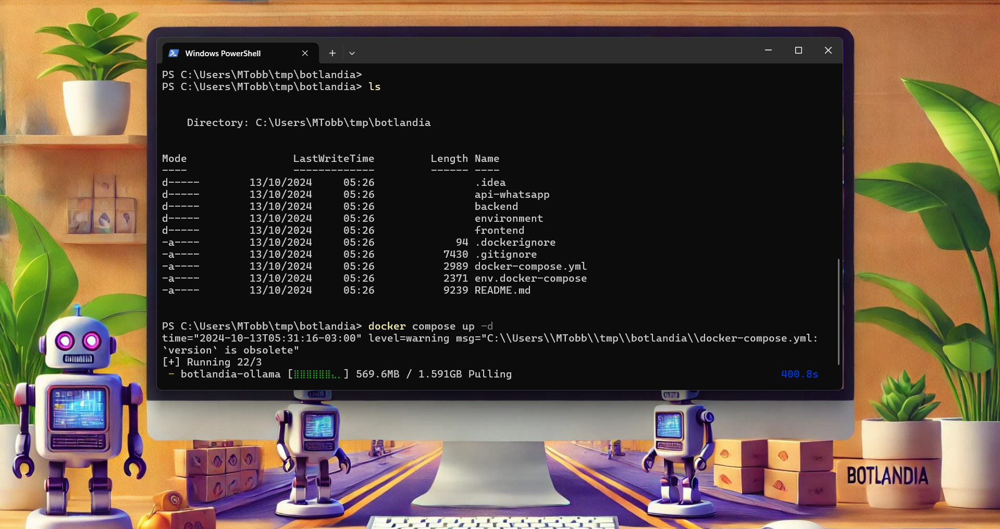
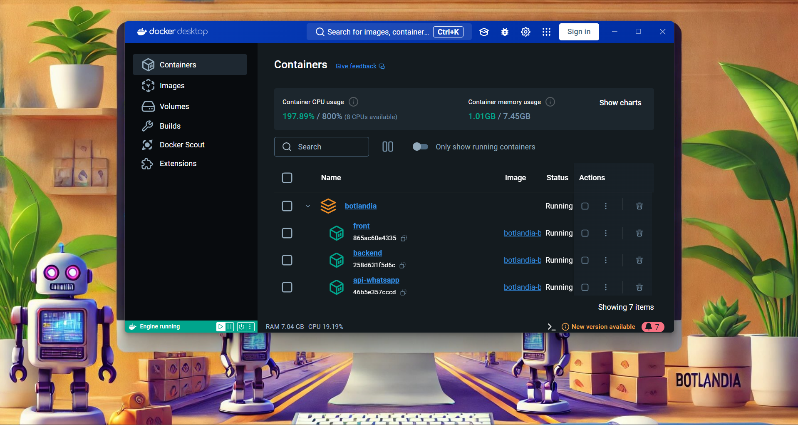
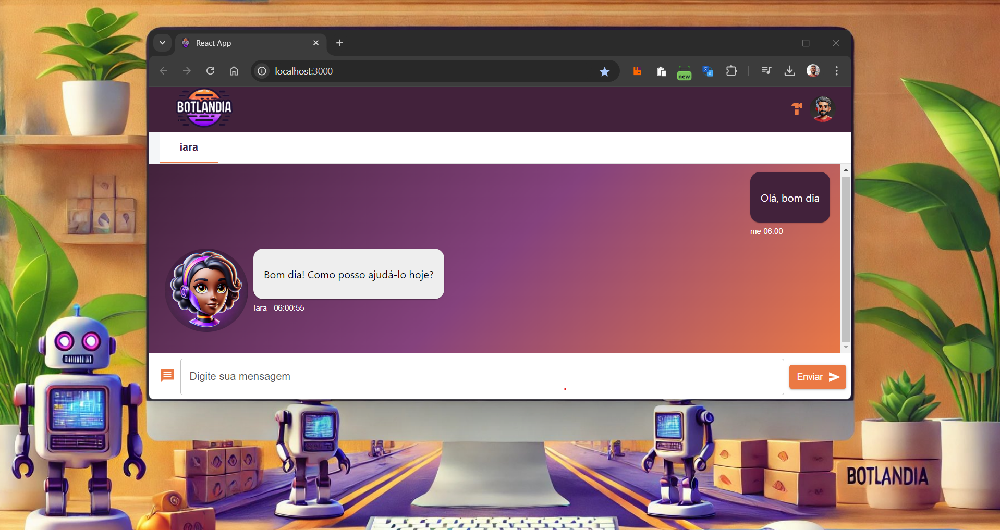

## 🚀 Sobre o Projeto

Botlandia é um projeto pessoal de um assistente para facilitar o dia a dia.

## 🛠️ Algumas Funcionalidades

- 🔍 **Pesquisa na Internet:** Encontre informações atualizadas e precisas com facilidade.
- 📺 **Pesquisa no YouTube:** Descubra vídeos relevantes e personalizados de acordo com suas preferências.
- 🎨 **Criação de Imagens:** Gere imagens incríveis a partir de descrições textuais.
- 🗣️ **Conversão de Texto em Fala:** Transforme texto em fala de forma clara e natural.
- 🗄️ **Gerenciamento de Bancos de Dados:** Utilize MongoDB, SQLite ou MySQL para armazenar e gerenciar informações de
  maneira eficiente.
- 🔄 **Mensageria com RabbitMQ:** Gerencie filas e mensagens de forma robusta e escalável.
- ✉️ **Envio de E-mails com Gmail:** Envie e gerencie e-mails de forma prática e segura através do Gmail.
- 💬 **Atendimento via WhatsApp:** Interaja com os usuários de maneira automatizada e amigável através do WhatsApp.

---

## Instalação
```bash
git clone https://github.com/mtobbias/botlandia.git
```
 

Entre no diretório do projeto
```bash
cd botlandia
```

No diretorio do projeto vai encontar um arquivo **env.docker-compose**

 

```
# =====================================
# IARA
# =====================================
#BOTLANDIA_IARA_BRAIN=OPEN_AI
#BOTLANDIA_IARA_BRAIN=OLLAMA
#BOTLANDIA_IARA_BRAIN=GOOGLE
#BOTLANDIA_IARA_BRAIN=GROQ
BOTLANDIA_IARA_BRAIN=OLLAMA
# =====================================
#BOTLANDIA_IARA_BRAIN=GOOGLE
#BOTLANDIA_IARA_BRAIN=GROQ
# =====================================
```
>Por padrão, o projeto utiliza a versão OLLAMA llama3.2:1b, 
> que não se mostrou eficaz na execução de ferramentas. 
> Recomendo o OPEN_AI com gpt-4o-mini ou GOOGLE gemini-1.5-pro para modelos mais robustos.

### ⚠️ Atenção ###
> Para utilizar OPEN_AI, é necessário informar a chave em BOTLANDIA_BACKEND_OPENAI_KEY
> https://platform.openai.com/playground


> Para utilizar GOOGLE, é necessário informar a chave em BOTLANDIA_BACKEND_GOOGLE_GEMINI_KEY
> https://aistudio.google.com/


Agora execute o comando Docker para criar os containers, esse processo demora alguns minutos.

>⚠️ Atenção:
>O projeto contém um container chamado "botlandia-ollama", ele vai realizar o download da versão llama3.2:1b (aproximadamente 2GB). Para mudar a versão do modelo, edite o arquivo "botlandia-ollama/run_ollama.sh".
>Veja mais em https://ollama.com/library/llama3.2.


```bash
docker compose up -d
```
 

Após a instalação, seu Docker deve estar assim:


 

Abra o seu navegador:
```bash
http://localhost:8080/
```

 

## Pronto, agora é só usar ##

---
### 📁 **Projetos**

- **api-whatsapp/** 📱
    - **Cliente API para WhatsApp Não Oficial:** Conecta-se através da aplicação de navegador WhatsApp Web.
    - **Funcionamento com Puppeteer:** A biblioteca lança a aplicação WhatsApp Web no navegador e a gerencia utilizando
      o Puppeteer para criar uma instância do WhatsApp Web, reduzindo o risco de bloqueio.
    - **Referência:** [whatsapp-web.js](https://github.com/pedroslopez/whatsapp-web.js)
    - **Observação:** Esta API não é oficial e utiliza métodos não suportados diretamente pelo WhatsApp, o que pode
      implicar em riscos de bloqueio da conta se os termos de uso forem violados.

- **back/** 🖥️
    - Backend em Node.js/websocket

- **front/** 🎨
    - Frontend em React/websocket

- **docker-compose.yml** 🐳
    - **Orquestração de Serviços:** Utiliza **Docker Compose** para integrar e gerenciar todos os serviços necessários
      da aplicação.
    - **Facilidade de Deploy:** Simplifica o processo de setup e deployment, assegurando que todas as dependências sejam
      configuradas corretamente.
    - **Ambiente Consistente:** Garante que a aplicação rode de maneira uniforme em diferentes ambientes, minimizando
      problemas de compatibilidade.

---

#  Iara

### Assistente Pessoal Principal

O nome **IAra** foi escolhido em referência à figura mitológica brasileira.

 

## 🧰 Ferramentas Disponíveis

Botlandia oferece uma ampla gama de ferramentas para atender às suas necessidades:

| Ferramenta             | 📝 Descrição                                                                             |
|------------------------|------------------------------------------------------------------------------------------|
| `MemoryTool`           | 🧠 Gerencia a memória ou o estado dos agentes, mantendo o contexto durante interações.   |
| `GmailTool`            | 📧 Integração com a API do Gmail para gerenciar e-mails diretamente através dos agentes. |
| `SqliteTool`           | 🗄️ Facilita operações CRUD com bancos de dados SQLite.                                  |
| `YouTubeTool`          | 🎥 Integração com a API do YouTube para gerenciar vídeos e playlists.                    |
| `DateTimeTool`         | 🕒 Manipulação e formatação de datas e horários.                                         |
| `WhatsAppTool`         | 📱 Integração com a API do WhatsApp para enviar e receber mensagens.                     |
| `RabbitMQTool`         | 📨 Interface para interagir com RabbitMQ para comunicação assíncrona.                    |
| `DownloadTool`         | ⬇️ Gerencia o download de arquivos a partir de URLs.                                     |
| `ReadFileTool`         | 📂 Leitura de arquivos do sistema de arquivos.                                           |
| `PuppeteerTool`        | 🌐 Automação de navegadores para tarefas como scraping e testes automatizados.           |
| `WriteFileTool`        | 📝 Escrita de arquivos no sistema de arquivos.                                           |
| `MongoAdminTool`       | 🗄️ Gestão do MongoDB utilizando a URI especificada.                                     |
| `IncarnationsTool`     | 🔄 Gerencia diferentes instâncias ou "encarnações" de agentes.                           |
| `SerperSearchTool`     | 🔍 Realiza buscas avançadas utilizando a API Serper.                                     |
| `ImageCreationTool`    | 🖼️ Cria ou manipula imagens utilizando modelos de geração de imagens.                   |
| `GoogleCalendarTool`   | 📅 Integração com o Google Calendar para gerenciar eventos e agendamentos.               |
| `ExecuteCommandTool`   | 💻 Executa comandos no sistema operacional diretamente.                                  |
| `ElevenLabsSpeakTool`  | 🎤 Integração com a API do ElevenLabs para síntese de fala audível.                      |
| `SearchDirectoryTool`  | 🔎 Pesquisa por arquivos e diretórios no sistema de arquivos.                            |
| `ImageDescriptionTool` | 🖼️📝 Gera descrições de imagens utilizando modelos de visão computacional.              |

# 🚀 Baixando e Executando o Botlandia com Docker-Compose

Baixe e execute o Botlandia utilizando **Docker-Compose**.  
Siga os passos abaixo para configurar e iniciar o seu ambiente de forma rápida e eficiente.

## 📋 Índice

1. [🔍 Introdução](#-introdução)
2. [🛠️ Pré-requisitos](#️-pré-requisitos)
3. [📥 Clonando o Repositório](#-clonando-o-repositório)
4. [🔧 Configurando as Variáveis de Ambiente](#-configurando-as-variáveis-de-ambiente)
5. [🐳 Executando com Docker-Compose](#-executando-com-docker-compose)
6. [✅ Verificando a Execução](#-verificando-a-execução)
7. [🛠️ Solução de Problemas](#️-solução-de-problemas)
8. [🎉 Conclusão](#-conclusão)

## 🛠️ Pré-requisitos

Antes de começar, certifique-se de que você possui os seguintes componentes instalados em sua máquina:

- **[Git](https://git-scm.com/downloads)**: Para clonar o repositório.
- **[Docker](https://www.docker.com/get-started)**: Para containerizar a aplicação.
- **[Docker-Compose](https://docs.docker.com/compose/install/)**: Para orquestrar os containers.

## 📥 Clonando o Repositório

Primeiro, você precisa clonar o repositório do Botlandia para o seu ambiente local.

[](./docker-compose.yml)

1. Abra o terminal ou prompt de comando.
2. Execute o seguinte comando para clonar o repositório:

    ```bash
    git clone https://github.com/mtobbias/botlandia.git
    cd botlandia
    ```
3. **Construa e inicie os containers** executando o seguinte comando na raiz do projeto:

   > **📌 Dica:** Utilize a flag `-d` para rodar os containers em modo *detached* (em segundo plano):

    ```bash
    docker-compose up --build -d
    ```

## 🔧 Configurando as Variáveis de Ambiente

> **⚠️ Atenção:**  
> Configure as variáveis de ambiente necessárias antes de iniciar os containers.  
> Consulte o arquivo `.env.example` para obter um guia sobre as variáveis necessárias.

## 🐳 Executando com Docker-Compose

Com os containers configurados e iniciados, sua aplicação deve estar rodando.  
Os serviços definidos no `docker-compose.yml` estarão ativos e prontos para uso.

## ✅ Verificando a Execução

Após iniciar os containers, verifique se o Botlandia está funcionando corretamente.

4. **Acesse a aplicação** abrindo seu navegador e navegando para:

    ```
    http://localhost:8080
    ```

## 🛠️ Solução de Problemas

Caso encontre algum problema durante a instalação ou execução, siga as dicas abaixo:

- **Verifique os Logs:** Utilize o comando `docker-compose logs` para identificar possíveis erros.
- **Reinicie os Containers:** Às vezes, reiniciar os containers pode resolver problemas temporários:

  ```bash
  docker-compose restart
    ```

---

> **⚠️ Nota:**
> - Todas as imagens foram geradas utilizando ChatGPT.
> - Parte ou totalidade de uma ferramenta utilizou ChatGPT.
> - Toda informação gerada por LLM deve ser verificada.
